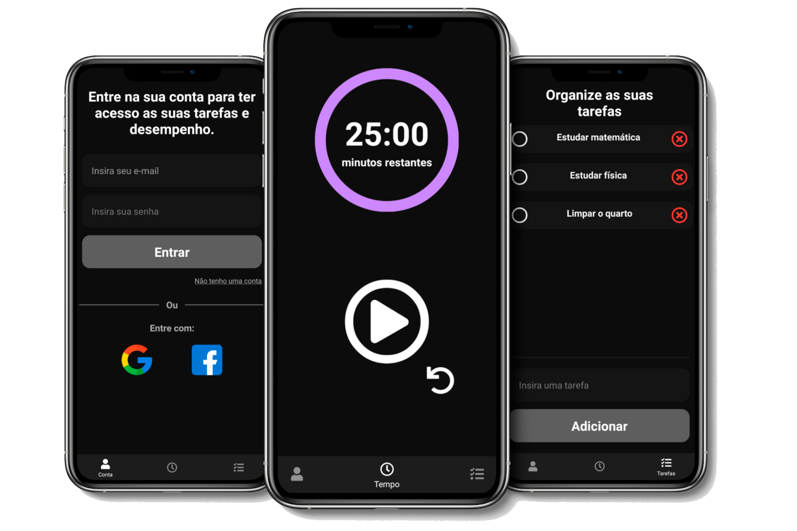

<h1 align="center">
  INFOCUS APP
</h1>

	<strong>Foque nas suas tarefas!</strong>👀

 

  

  
  
  
  

---

<h4 align="center">
	🚧 Infocus App 🚀 Em construção... 🚧
</h4>

---

<h2>Tópicos:</h2>
<ul>
	<li><a href="#sobre-o-projeto">Sobre</a></li>
	<li><a href="#layout">Layout</a></li>
	<li><a href="#tecnologias">Tecnologias</a> </li>
	<li><a href="#autores">Autores</a></li>
</ul>

---

<h2 id="sobre-o-projeto">💻 Sobre o Projeto</h2>

📝 **Infocus:** *__é uma forma de aumentar seu foco e produtividade, gerenciando seu tempo e tarefas. Com ele você pode registrar suas tarefas e o aplicativo cronometra seu tempo de atividade e descanso.__*

---

<h2 id="layout">🎨 Layout</h2>

O layout da aplicação está disponível no Figma:

### Mobile

  

---

<h2 id="tecnologias">🛠 Tecnologias</h2>

Algumas das ferramentas usadas na construção do projeto:

-   **[Typescript](https://www.typescriptlang.org/)**
-   **[React Native](http://www.reactnative.com/)**
-   **[React Navigation](https://reactnavigation.org/)**
-   **[React Native SVG](https://github.com/react-native-community/react-native-svg)**
-   **[React Countdown Circle Timer](https://www.npmjs.com/package/react-countdown-circle-timer)**
-   **[React Native Vector Icons](https://github.com/oblador/react-native-vector-icons)**
-   **[NodeJS](https://nodejs.org/en/)**
-   **[Express](https://expressjs.com/pt-br/)**
-   **[MySQL](https://www.mysql.com/)**
-   **[Sequelize](https://sequelize.org/)**
-   **[Nodemon](https://nodemon.io/)**

---

<h2 id="autores">🦸 Autores</h2>

| [    Marcos Campos ](https://github.com/Markimg22) | [    Gabriel Fonseca ](https://github.com/gabrielbugarelli) |
| :---: | :---:

---
